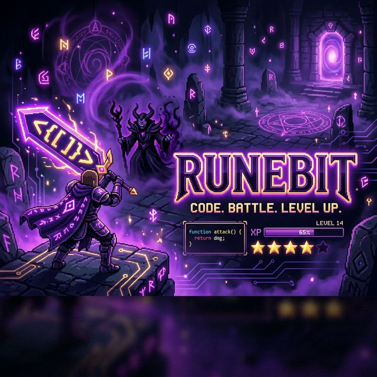
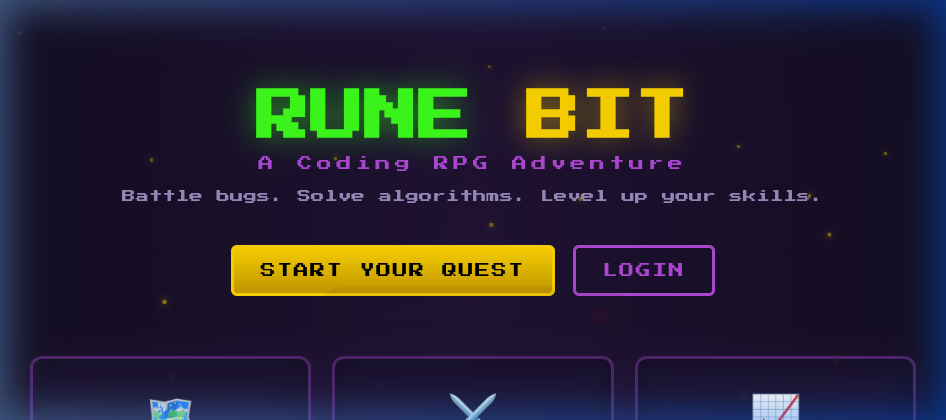
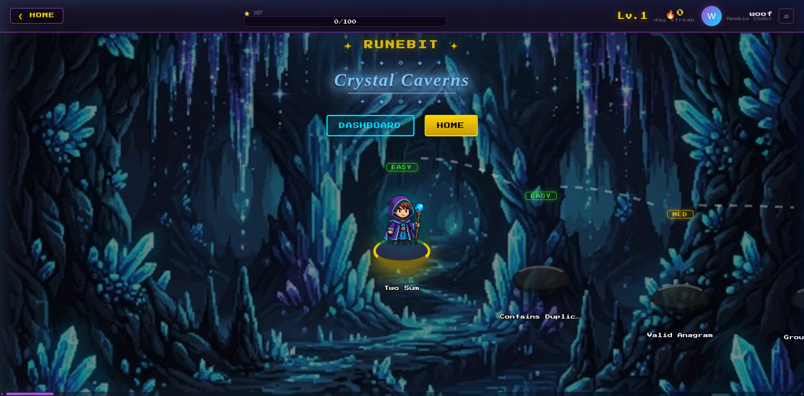
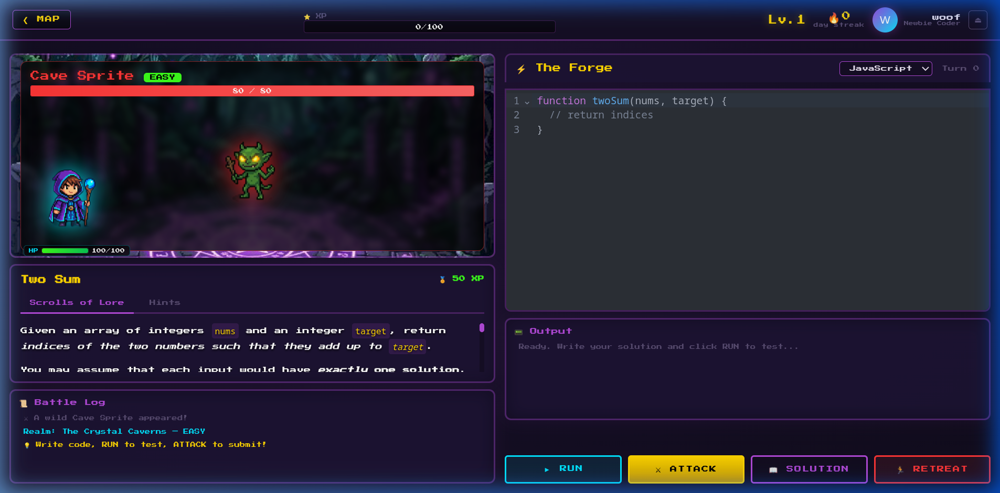

<p align="center">
  
</p>

<h1 align="center">Runebit</h1>
<p align="center"><strong>Code. Battle. Level Up.</strong></p>
<p align="center">A gamified RPG platform for learning Data Structures & Algorithms</p>

<p align="center">
  
</p>

---

## ⚔️ What is Runebit?

Runebit transforms the dry grind of DSA practice into an immersive RPG adventure. Players battle fantasy enemies — from goblins to elder dragons — by writing **real, executable code** in JavaScript, Python, Java, or C++. Every correct solution deals damage; every failed attempt costs HP. Earn XP, level up, unlock new realms, and collect achievements.

<p align="center">
  
</p>

## ✨ Features

| Feature | Description |
|---|---|
| 🗺️ **7-Tier World Map** | Scrollable map with unique backgrounds, divider walls, and 17 topic realms |
| ⚔️ **85 Coding Problems** | Real DSA challenges from arrays to dynamic programming, categorized as Easy / Medium / Boss |
| 🐍 **4 Languages** | JavaScript, Python, Java, C++ — compiled & executed via remote compiler API |
| 🎮 **Battle System** | Animated combat with hero sprites, enemy HP bars, hit markers, and victory fanfares |
| 📖 **Solution Viewer** | Peek at formatted solutions with syntax highlighting (20% XP penalty) |
| ⭐ **Star Ratings** | Earn 1-3 stars per problem based on runtime performance |
| 🏆 **12 Achievements** | Badges like First Blood, Dragon Slayer, Unstoppable (7-day streak) |
| 🔥 **Daily Streaks** | Consecutive-day tracking to build coding habits |
| 🔐 **Google OAuth** | One-click sign-in via Google Identity Services |
| 📊 **Dashboard** | Profile card, XP progress, tier completion, topic skills, and achievement badges |

### 🗺️ World Map
<p align="center">
  
</p>

### ⚔️ Battle Screen
<p align="center">
  
</p>

## 🛠️ Tech Stack

| Layer | Technology |
|---|---|
| **Frontend** | React, Vite, React Router, CodeMirror, Prettier |
| **Styling** | Vanilla CSS with custom design system (pixel art + neon glow) |
| **Backend** | Node.js, Fastify, Prisma ORM |
| **Database** | SQLite |
| **Auth** | JWT + Google OAuth 2.0 |
| **Code Execution** | OnlineCompiler.io API (Python 3.14, OpenJDK 25, G++ 15) |
| **Fonts** | Press Start 2P (Google Fonts) |

## 📁 Project Structure

```
runebit/
├── public/              # Static assets (sprites, backgrounds, favicon)
│   └── assets/          # Game art: heroes, villains, battle backgrounds
├── src/
│   ├── components/      # Reusable UI (HUD)
│   ├── contexts/        # AuthContext, GameContext (state management)
│   ├── screens/         # Pages: Landing, Login, WorldMap, Battle, Dashboard
│   └── utils/           # Audio, code formatting
├── server/
│   ├── src/
│   │   ├── routes/      # API: auth, problems, submissions, users
│   │   ├── services/    # Code execution engine (judge0.js)
│   │   └── seed/        # 85 problems across 17 topics
│   └── prisma/          # Database schema & migrations
├── index.html
└── package.json
```

## 🚀 Getting Started

### Prerequisites

- **Node.js** 18+
- **npm** 9+

### 1. Clone & Install

```bash
git clone https://github.com/your-username/runebit.git
cd runebit

# Frontend
npm install

# Backend
cd server
npm install
```

### 2. Set Up the Database

```bash
cd server
npm run db:reset    # Creates SQLite DB, runs migrations, seeds 85 problems
```

### 3. Start Development Servers

```bash
# Terminal 1 — Backend (port 3001)
cd server
npm run dev

# Terminal 2 — Frontend (port 5173)
cd ..
npm run dev
```

### 4. Open in Browser

```
http://localhost:5173
```

## 🔑 Google OAuth Setup

1. Go to [Google Cloud Console](https://console.cloud.google.com) → **APIs & Services → Credentials**
2. Create an **OAuth 2.0 Client ID** (Web application)
3. Add `http://localhost:5173` to **Authorized JavaScript Origins**
4. Replace the `client_id` in `src/screens/LoginScreen.jsx` with your own

## 🎮 How It Works

1. **Sign up** with email/password or **Google OAuth**
2. **Explore the World Map** — scroll through 7 tiers of fantasy realms
3. **Pick a quest** — each node is a coding problem with an enemy to defeat
4. **Write code** in the battle editor — choose your language
5. **Run** to test against sample cases, **Attack** to submit
6. Passing all tests **damages the enemy** — failing **hurts you**
7. Defeat the enemy to **earn XP, stars, and progress**
8. **Level up**, unlock new tiers, earn **achievements**

## 📜 Problem Difficulty

| Difficulty | Villain | XP Reward |
|---|---|---|
| 🟢 Easy | Tier 1 Goblin | 60 XP |
| 🟡 Medium | Dark Elf Rogue | 100 XP |
| 🔴 Boss | Unique per-tier dragon/titan | 200-500 XP |

## 🏆 Achievements

| Badge | Requirement |
|---|---|
| 🗡️ First Blood | Solve 1 problem |
| 📜 Apprentice | Solve 5 problems |
| ⚔️ Code Warrior | Solve 15 problems |
| 🛡️ Champion | Solve 30 problems |
| 👑 Legendary | Solve 50 problems |
| 🌟 All Clear | Solve all 85 problems |
| ⭐ Perfectionist | Earn 30+ total stars |
| ✨ Star Hunter | Earn 100+ total stars |
| 🔥 On Fire | 3-day streak |
| 💥 Unstoppable | 7-day streak |
| 🐉 Dragon Slayer | Reach Tier 7 |
| 🎮 Level 10 | Reach Level 10 |

## 🌐 Deployment

**Frontend** → Deploy to [Vercel](https://vercel.com):
```bash
npm run build
# Deploy the `dist/` folder
```

**Backend** → Deploy to [Railway](https://railway.app) or [Render](https://render.com):
- Set environment variable `DATABASE_URL` for your production DB
- Update `API` base URL in `src/contexts/AuthContext.jsx`
- Add your production URL to Google OAuth **Authorized JavaScript Origins**

## 📄 License

MIT License — feel free to fork, modify, and build upon Runebit.

---

<p align="center">
  <strong>Runebit</strong> — Where algorithms become adventures 🏰
</p>
